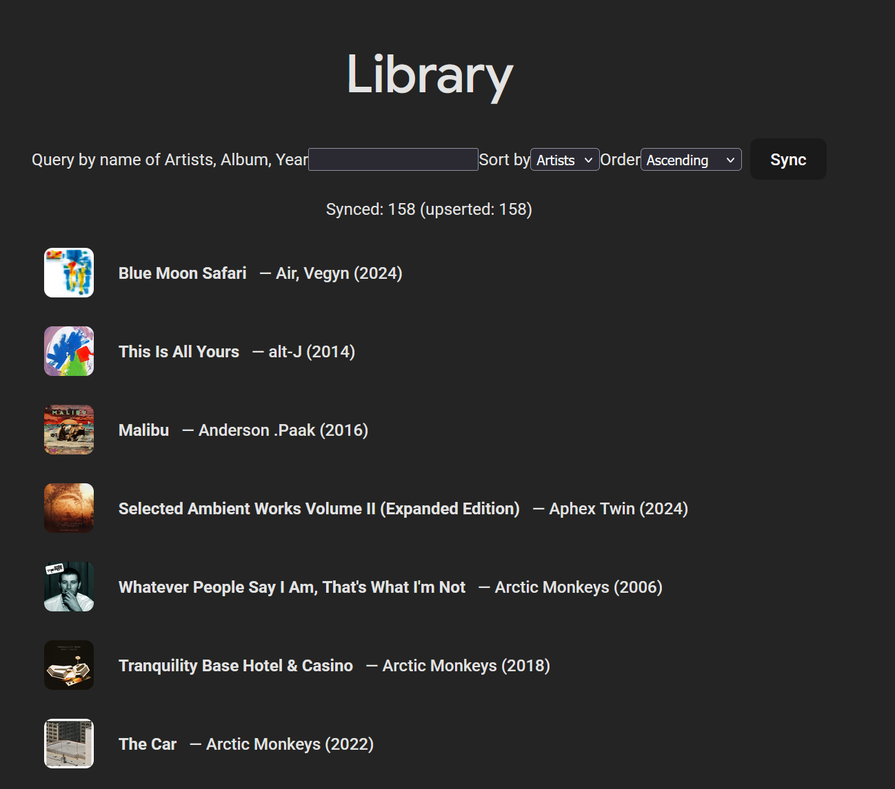

# ytm-album-organizer

Local-first web app to view your saved YouTube Music albums, search/sort/filter them, cache covers in SQLite, and open each album in YouTube Music in one click.

> ⚠️ Important: this project uses **browser authentication** (`browser.json`) via a **non-official** library. It works locally but may break if YouTube Music changes or if your session expires. This is **not** meant to be a hosted/SaaS service.

---

## Features

- Local sync of your saved albums (cached in SQLite)
- Client-side search (title / artists / year)
- Sorting (title / artists / year)
- Covers stored in DB (placeholder if missing)
- Robust “Open album” links (browse/playlist depending on ID type)

---

## Tech stack

- Frontend: Vite + React + TypeScript
- Backend: FastAPI + SQLite
- Proxy: Vite `/api` → `http://127.0.0.1:8000`

---

## Screenshots

## Requirements

- Node.js (LTS)
- Python 3.10+ recommended
- A locally generated `browser.json` (NOT included in the repo)

---

## Dev setup

### 1) Backend

~~~bash
cd backend
python -m venv .venv
# Activate venv:
# - Windows: .venv\Scripts\activate
# - macOS/Linux: source .venv/bin/activate
pip install -r requirements.txt
uvicorn app.main:app --reload
~~~

Backend runs at `http://127.0.0.1:8000`.

### 2) Frontend

~~~bash
cd frontend
npm install
npm run dev
~~~

Open `http://localhost:5173`.

---

## Authentication (browser.json)

This project requires:

- `backend/data/browser.json`

Rules:
- Keep it on your machine only.
- Never share it.
- Never commit it to Git (the repo is configured to ignore it).

How to generate it:
- Follow the “Browser Authentication” section in the [ytmusicapi docs](https://ytmusicapi.readthedocs.io/en/stable/setup/browser.html)
- Save the resulting file as `backend/data/browser.json`.

If Sync suddenly fails, your session was likely invalidated/expired — regenerate `browser.json`.

---

## Usage

1) Open the web app
2) Click **Sync**
3) Use search + sort controls
4) Click any album to open it in YouTube Music

---

## Local data

- SQLite DB: `backend/data/app.db`
- Credential: `backend/data/browser.json`

---

## Troubleshooting

- **Sync fails**: regenerate `backend/data/browser.json`
- **Missing covers**: run Sync again (some albums need a fallback fetch)
- **Schema/columns errors**: ensure you’re on the latest backend version (migrations run on startup)
- **Blank UI**: check browser console and confirm the backend is running and Vite proxy points to `127.0.0.1:8000`

---

## Roadmap

- v0.2: Album detail view (modal/page) + on-demand enrichment (MusicBrainz + Wikidata)
- v0.3: Virtualized list / pagination + sync progress + `last_sync`
- v0.4: UX polish, facet filters, packaging (desktop/local)

---

## Contributing

See `CONTRIBUTING.md`.

---

## License

MIT — see `LICENSE`.
